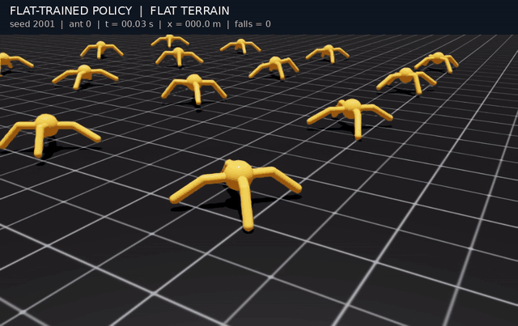
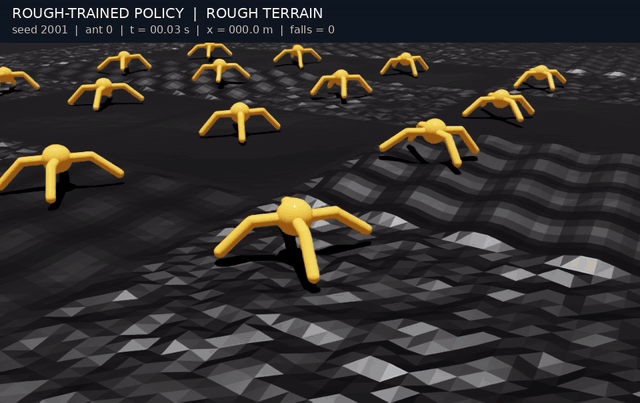
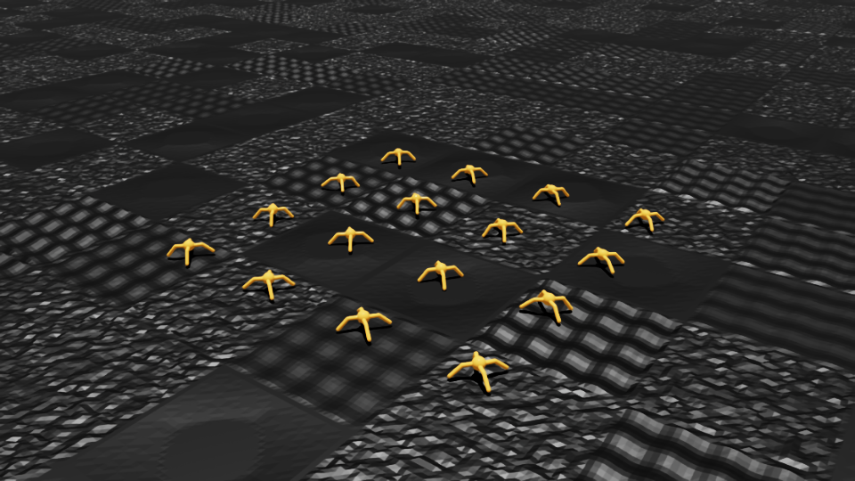
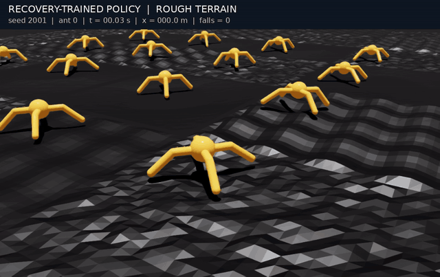

# Ant: 평지 모델 → 험지 모델 → 추가 학습 모델

Isaac Lab의 Ant가 평지에서 걷는 것부터 시작해, 랜덤 험지에 적응하고 안정성을 높이는 과정을 세 모델로 정리했습니다.

각 모델의 보행 미리보기는 실제 영상의 앞 6초를 원래 속도로 반복 재생합니다. 움직이는 이미지를 누르면 전체 16초 영상을 볼 수 있습니다.

| 구분 | 평지 모델 | 험지 모델 | 추가 학습 모델 |
| --- | --- | --- | --- |
| 목적 | 원본 환경의 기준 보행 | 울퉁불퉁한 지형에 적응 | 험지에서 낙상과 몸체 흔들림 감소 |
| 학습 지형 | 원본 평면 | 랜덤 요철·파도·경사 | 험지 모델과 동일 |
| 핵심 변경 | 원본 태스크 | 지형·높이 관측·충돌·낙상 판정 | 안정성을 고려한 리워드 |
| 학습량 | 1,000회 | 1,000회 | 험지 모델에서 600회 추가 |
| 체크포인트 | [flat.pt](artifacts/models/flat.pt) | [rough.pt](artifacts/models/rough.pt) | [recovery.pt](artifacts/models/recovery.pt) |

여기서 ‘추가 학습 모델’은 최종 `recovery.pt`를 뜻합니다. 관측 60차원, 액션 8차원, PPO 네트워크 구조는 세 모델이 같습니다. 평지·험지 모델은 각각 학습했으며, 추가 학습 모델은 험지 모델의 가중치에서 이어 학습했습니다.

## 1. 평지 모델

원본 `Isaac-Ant-v0`의 평면 환경에서 보행을 학습한 기준 모델입니다. 전진·생존·자세 보상과 에너지 등의 패널티를 사용합니다.

평지에서는 걷지만, 새 험지에 적용했을 때 16초 생존율은 17.48%, 평균 전진 거리는 15.61m였습니다. 이 험지 평가에는 공통 지면 상대 높이 관측을 적용했습니다.

[](artifacts/media/flat_on_flat.mp4)

[평지 보행 영상](artifacts/media/flat_on_flat.mp4) · [험지에 적용한 영상](artifacts/media/flat_on_rough.mp4) · [원본 설정](reference/original/ant_env_cfg.py)

## 2. 험지 모델

평면을 연속적인 랜덤 요철·파도·경사 지형으로 바꾸고 같은 1,000회 예산으로 학습했습니다. 원본 보상은 유지하면서 다음을 수정했습니다.

- 원본의 5m 간격 격자 배치를 유지하고, 시작 높이를 지형에 맞췄습니다.
- 몸통 높이 관측과 낙상 판정을 바로 아래 지면 기준으로 바꿨습니다.
- 타일 경계를 연결하고 충돌 메시를 공간별로 나눠 정상적으로 밟고 걷도록 했습니다.

[](artifacts/media/rough_on_rough.mp4)

<details>
<summary>생성된 험지 사진 보기</summary>



</details>

지형은 720×720m이고 테두리는 없습니다. 평지 모델과 같은 새 지형(seed 2001/2002)에서 생존율은 17.48% → 91.41%, 평균 거리는 15.61m → 67.98m로 늘었습니다.

[험지 보행 영상](artifacts/media/rough_on_rough.mp4) · [평지 모델과 같은 험지에서 비교한 영상](artifacts/media/comparison.mp4) · [환경 구현](docs/IMPLEMENTATION.md)

## 3. 추가 학습 모델

험지 모델에서 리워드를 개선해 600회 더 학습했습니다. 낙상과 위험 자세를 직접 감점하고, 과속으로 얻는 추가 보상을 제한했습니다.

- 넘어지는 순간 -10점.
- 지면 상대 몸높이 0.48m 아래와 큰 기울기에 연속 감점.
- 전진 보상은 4.5m/s에서 상한 적용. 액션 변화와 몸체 각속도에도 작은 패널티 적용.

지형·관측·액션·낙상 종료 기준은 험지 모델과 같습니다. 별도의 새 지형(seed 4001/4002)에서 두 모델을 비교했습니다.

| 지표 | 험지 모델 | 추가 학습 모델 |
| --- | ---: | ---: |
| 16초 생존율 | 90.43% | 94.63% |
| 낙상 / 1,024회 | 98 | 55 |
| 몸체 각속도 RMS | 2.063 rad/s | 1.796 rad/s |
| 평균 전진 속도 | 4.34m/s | 4.16m/s |
| 평균 전진 거리 | 67.30m | 65.56m |

낙상은 43.9%, 몸체 각속도 RMS는 13.0% 줄었습니다. 대신 속도는 4.2%, 거리는 2.6% 낮아져, 조금 느리지만 더 안정적으로 걷는 모델입니다.

[](artifacts/media/reward_revision/recovery_on_rough.mp4)

[보행 영상](artifacts/media/reward_revision/recovery_on_rough.mp4) · [리워드 설계와 코드](docs/REWARD_DESIGN.md) · [단계별 평가 결과](docs/RESULTS.md)

두 평가 묶음은 지형 seed가 다르므로 수치를 섞지 않았습니다. 각 비교는 모델별 512마리 × 2개 지형의 첫 16초 에피소드 기준입니다. 영상은 별도의 16환경 데모이며, 학습 seed는 하나입니다. [실험 조건과 해석 범위](docs/EXPERIMENTS.md)

## 실행

[설치·학습·평가 명령](docs/REPRODUCE.md)에 따라 고정한 IsaacLab_RS 원본에 패치를 적용합니다. 패치와 실행 환경을 준비한 뒤 공개 저장소 루트에서:

```bash
export ISAACLAB_ROOT="$(cd ../IsaacLab_RS_ant && pwd)"
"$ISAACLAB_ROOT/isaaclab.sh" -p \
  "$ISAACLAB_ROOT/scripts/reinforcement_learning/rsl_rl/play.py" \
  --task Isaac-Ant-Recovery-v0 --num_envs 64 \
  --checkpoint "$PWD/artifacts/models/recovery.pt" --diagnostics
```

험지 모델은 같은 명령에서 태스크를 `Isaac-Ant-v0`, 체크포인트를 `rough.pt`로 바꿉니다. 평지 모델의 원본 평지 실행은 [별도 원본 checkout 안내](docs/REPRODUCE.md)를 따릅니다.

## 코드와 자료

| 자료 | 내용 |
| --- | --- |
| [원본 설정](reference/original) | 평지 모델의 출발점 |
| [변경 코드](overlay) · [패치](patches/isaaclab.patch) | 험지 환경과 추가 학습 리워드 구현 |
| [학습 설정](configs/runs) · [체크포인트](artifacts/models) | 세 대표 모델과 검증용 모델 |
| [결과](docs/RESULTS.md) · [영상](docs/MEDIA.md) | 단계별 수치와 실제 시뮬레이션 |
| [재현 방법](docs/REPRODUCE.md) · [모델 해시](manifest.json) | 실행 조건과 파일 검증 |

<details>
<summary>중간 실험·대조군·개발 기록</summary>

초기 안정성 보상, 강한 패널티 실패, 동일 예산 대조군과 디버깅 과정은 [실험 기록 모음](docs/archive/README.md)에 묶었습니다. 원시 측정값과 모델은 검증·재현을 위해 보존했습니다.

</details>

## 참고

[Isaac Lab](https://github.com/isaac-sim/IsaacLab)과 [기반 IsaacLab_RS](https://github.com/cailab-hy/IsaacLab_RS/tree/e83a5d2f11ca1b5f03b690e1978479e620c500e2)의 Ant 태스크를 사용했습니다. [Robust Ant PPO — Week 03](https://github.com/williewonker777/robotics-simulation-week03-ant-robust)는 실험 기록 구성 방식을 참고했으며 모델이나 결과를 가져오지 않았습니다.

코드는 [BSD-3-Clause](LICENSE)와 원 저작권 고지를 유지합니다. Isaac Sim 및 외부 로봇 에셋은 포함하지 않습니다. [공개 범위](docs/PUBLICATION.md)
