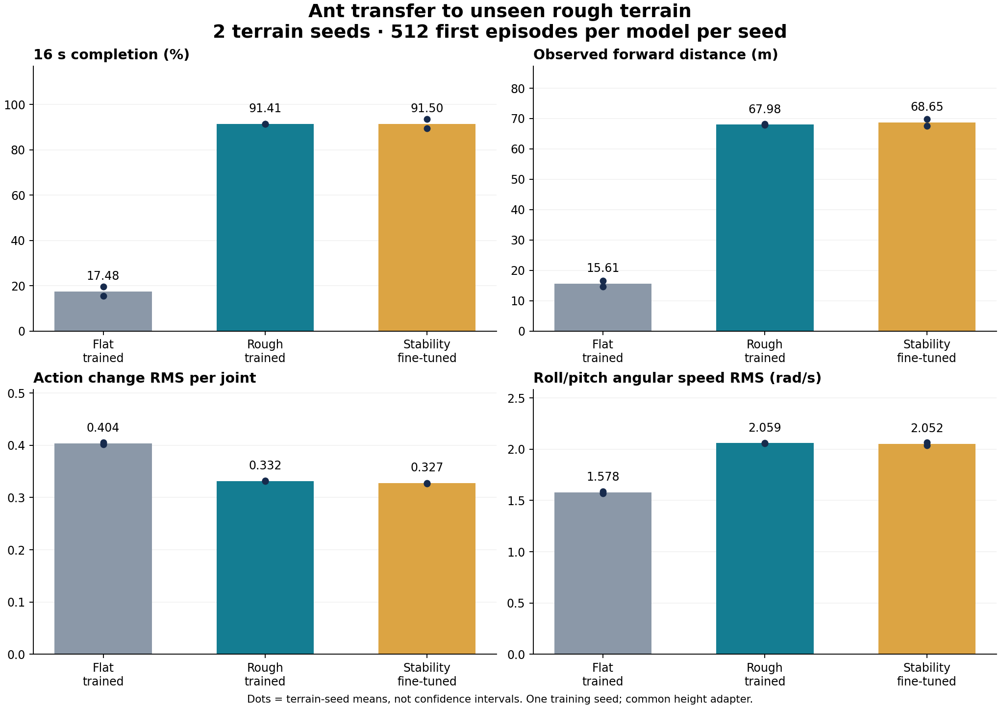
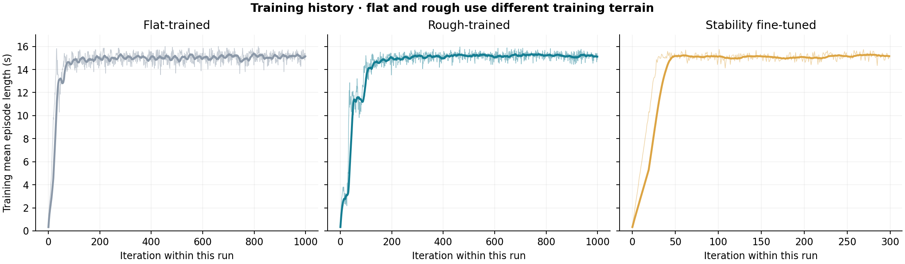

# Ant: 평지 보행에서 울퉁불퉁한 지형으로

Isaac Lab의 원본 `Isaac-Ant-v0`를 출발점으로, **연속적인 랜덤 지형을 구현하고 실제 충돌·리셋 문제를 수정한 뒤 험지 보행을 학습한 프로젝트**입니다. 원본 평지 학습 정책이 새 지형에서도 걸을 수 있는지, 험지 학습과 안정성 보상 추가가 무엇을 바꾸는지 실험했습니다.

**핵심 결과:** 새 지형 2종에서 평지 학습 모델의 16초 완주율은 **17.48%**, 험지 학습 모델은 **91.41%**였습니다. 안정성 보상 추가 학습은 액션 변화를 소폭 줄였지만, 지형별 완주율이 오르기도 내리기도 해 일관된 우위를 확인하지 못했습니다.

이 결과는 **학습 시드 1개, 동일한 지형 생성 분포의 새 시드 2개**에서 측정했습니다. 모든 미지 환경에 대한 강건성이나 안정성 보상만의 인과효과를 주장하지 않습니다.



## 원본에서 무엇을 바꿨나

| 항목 | 원본 평지 태스크 | 험지 태스크 | 안정성 추가 학습 |
| --- | --- | --- | --- |
| 바닥 | 무한 평면 | 랜덤 요철·파도·정/역경사 | 험지와 동일 |
| 높이 관측 | 몸통의 절대 Z | 몸통과 바로 아래 지면의 높이 차 | 험지와 동일 |
| 낙상 종료 | 몸통 높이 0.31m 미만 | 지면 상대 높이 0.31m 미만 | 험지와 동일 |
| 개미 배치 | 5m 간격 격자 | XY 격자 유지, 지형에 맞춰 시작 Z 보정 | 험지와 동일 |
| 관측 / 액션 | 60D / 8D 토크 제어 | 60D / 8D 유지 | 60D / 8D 유지 |
| 충돌 지형 | 평면 collider | 공간별 36개 triangle collider | 험지와 동일 |
| 보상 | 전진·생존·자세·에너지 등 | 기존 보상 유지 | 액션 변화·몸통 각속도 패널티 추가 |
| 학습량 | 1,000회 | 1,000회 | 험지 모델에서 300회 추가 |

현재 지형은 **6m 타일 × 120행 × 120열 = 720m × 720m**입니다. 테두리 폭은 0이고 타일을 연결했습니다. 최초 요청에서 검토했던 100m 크기가 아닌, 실제 평가에 사용한 최종 설정을 공개합니다. [구현 상세](docs/IMPLEMENTATION.md)

## 새 지형 평가 결과

모델별 512마리 × 지형 시드 2개 = **1,024개 첫 에피소드**를 평가했습니다. 전체 비교는 3,072개 에피소드입니다. 자동 리셋 이후의 다음 에피소드는 집계하지 않습니다.

| Model | Episodes | Completion | Forward distance | Action change RMS | Body angular speed RMS |
| --- | ---: | ---: | ---: | ---: | ---: |
| Flat-trained | 1024 | 17.48% | 15.61 m | 0.4037 | 1.5785 rad/s |
| Rough-trained | 1024 | 91.41% | 67.98 m | 0.3318 | 2.0592 rad/s |
| Stability fine-tuned | 1024 | 91.50% | 68.65 m | 0.3274 | 2.0518 rad/s |

평지 모델에도 동일한 **지면 상대 높이 관측 변환**을 적용해 험지에서 비교했습니다. 원본 평지 모델을 아무 수정 없이 절대 Z 관측으로 실행한 결과와는 다릅니다. 험지 모델 두 개는 같은 장면·관측·종료 조건에서 평가했습니다.

추가 학습 모델은 시드 2001에서 완주율이 91.41%→89.45%로 내려갔고, 시드 2002에서는 91.41%→93.55%로 올랐습니다. 평균 수치만으로 안정성이 개선됐다고 결론짓지 않았습니다. **기본 재현·데모 모델은 험지 학습 모델 `rough.pt`**로 두고, 추가 보상 모델과 실패한 강한 패널티 실험도 함께 공개합니다.

[전체 수치와 해석](docs/RESULTS.md) · [실험 설계와 한계](docs/EXPERIMENTS.md) · [실패·수정 과정](docs/DEVLOG.md)

## 코드와 실행

이 저장소는 Isaac Sim 전체를 포함하지 않는 **IsaacLab_RS 변경 코드와 재현 자료 묶음**입니다. 기반 저장소의 커밋을 고정하고 패치를 적용합니다.

```bash
git clone https://github.com/Stick-0/isaac-ant-rough-terrain.git
git clone https://github.com/cailab-hy/IsaacLab_RS.git IsaacLab_RS_ant
git -C IsaacLab_RS_ant checkout e83a5d2f11ca1b5f03b690e1978479e620c500e2
python isaac-ant-rough-terrain/scripts/apply_overlay.py IsaacLab_RS_ant --check
python isaac-ant-rough-terrain/scripts/apply_overlay.py IsaacLab_RS_ant
```

Isaac Sim 5.1 / Isaac Lab 2.3 실행 환경을 준비한 뒤:

```bash
# 이 저장소 루트에서 실행. Isaac Lab용 Python 환경을 먼저 활성화한다.
export ISAACLAB_ROOT="$(cd ../IsaacLab_RS_ant && pwd)"
"$ISAACLAB_ROOT/isaaclab.sh" -p \
  "$ISAACLAB_ROOT/scripts/reinforcement_learning/rsl_rl/play.py" \
  --task Isaac-Ant-v0 --num_envs 64 \
  --checkpoint "$PWD/artifacts/models/rough.pt" --diagnostics

# 세 모델을 같은 새 지형에서 평가
bash scripts/evaluate.sh 2001 2002
```

GPU 없이 표와 그래프를 다시 만들 수 있습니다.

```bash
python -m pip install -r requirements-analysis.txt
python scripts/analyze.py
python scripts/verify_package.py
```

[설치·학습·추가 학습·평가 명령 전체](docs/REPRODUCE.md)

## 학습 기록



평지 학습과 험지 학습은 환경 난이도가 다릅니다. 그래프의 높은 값만으로 정책의 우열을 비교하지 않고, 위의 동일 험지 평가로 비교했습니다. 추가 학습의 반복 횟수는 새 옵티마이저로 시작한 이후의 값입니다.

초기 로그에는 무작위 episode counter 초기화와 새 집계 버퍼의 영향이 포함됩니다. 추가 학습 곡선이 낮은 값에서 시작하는 것이 정책 가중치를 무작위로 초기화했다는 뜻은 아닙니다.

## 저장소 구성

```text
overlay/                  실제 수정·추가한 Isaac Lab 코드 10개
reference/original/       기반 커밋의 원본 Ant 설정
patches/isaaclab.patch    고정한 원본에 적용할 전체 변경
configs/runs/             각 학습 실행의 환경·PPO 설정
artifacts/models/         평지·험지·추가 학습·실패 실험 체크포인트
artifacts/figures/        원시 결과에서 생성한 그래프
results/transfer/         새 지형 2001/2002에서 세 모델의 측정값
results/stability/        이전 1001/1002 실험과 강한 패널티 실패 기록
results/training/         TensorBoard에서 추출한 학습 곡선 CSV
scripts/                  패치 적용·평가·집계·무결성 검증
docs/                     설계·구현·결과·재현·개발 기록
manifest.json             원본 커밋·환경 버전·모델 SHA-256
```

## 참고와 출처

- [Isaac Lab](https://github.com/isaac-sim/IsaacLab), [기반 IsaacLab_RS](https://github.com/cailab-hy/IsaacLab_RS/tree/e83a5d2f11ca1b5f03b690e1978479e620c500e2): Ant 태스크와 시뮬레이터 코드의 출처.
- [Robust Ant PPO — Week 03](https://github.com/williewonker777/robotics-simulation-week03-ant-robust): 실험 조건·원시 결과·실패·재현 방법을 함께 공개하는 구성 방식을 참고했습니다. 해당 프로젝트의 모델·성과를 이 프로젝트의 결과로 사용하지 않았으며, 동일 실험도 아닙니다.

코드는 [BSD-3-Clause](LICENSE) 라이선스와 원 저작권 고지를 유지합니다. Isaac Sim 및 외부 로봇 에셋은 배포하지 않습니다. [공개 범위와 검증](docs/PUBLICATION.md)
