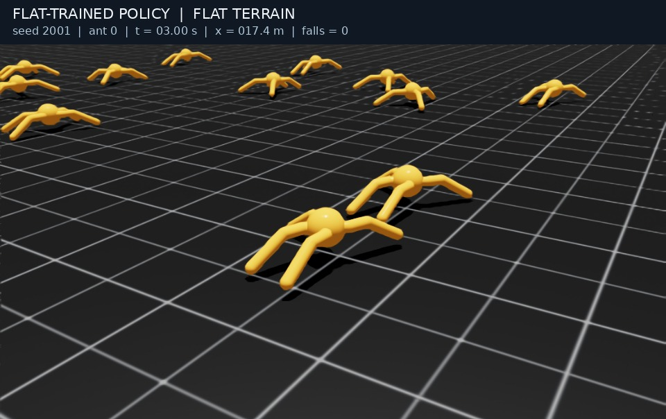
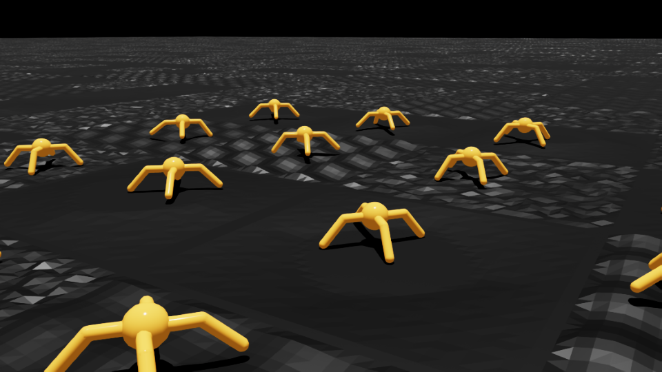
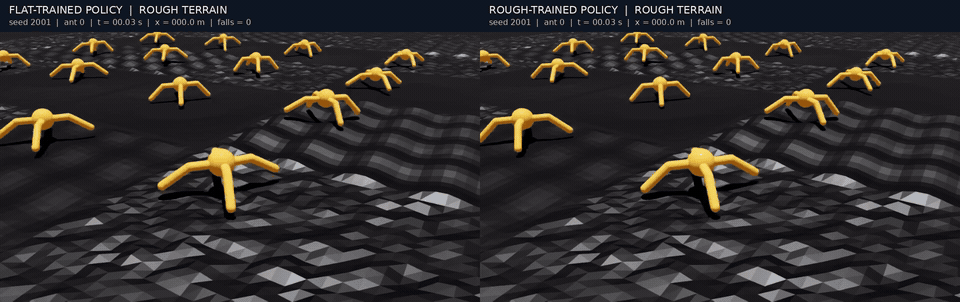

# 세 모델의 지형과 보행 영상

모든 사진과 영상은 저장된 모델을 Isaac Sim에서 실제 실행해 촬영했다. 각 영상은 16초, 30fps이며 별도의 16환경 데모다.

## 1. 평지 모델

[](../artifacts/media/flat_on_flat.mp4)

[원본 평지 보행](../artifacts/media/flat_on_flat.mp4)은 학습한 환경의 기준 동작이다. [같은 모델을 험지에 적용한 영상](../artifacts/media/flat_on_rough.mp4)에서는 지형이 바뀌었을 때의 동작을 볼 수 있다.

## 2. 험지 모델



seed 2001로 생성한 720×720m 지형의 일부다. 요철·파도·경사 타일을 연결했고 시작 위치는 원본과 같은 5m 격자다. [험지 모델의 16초 보행](../artifacts/media/rough_on_rough.mp4).

[](../artifacts/media/comparison.mp4)

왼쪽은 평지 모델, 오른쪽은 험지 모델이다. GIF는 첫 6초의 실시간 미리보기이며 [전체 비교 영상](../artifacts/media/comparison.mp4)은 16초다.

## 3. 추가 학습 모델

[](../artifacts/media/reward_revision/recovery_on_rough.mp4)

[`recovery.pt`의 16초 보행 영상](../artifacts/media/reward_revision/recovery_on_rough.mp4)이다. 기존 험지 영상과 지형·초기 상태 해시·카메라 조건이 같다. 촬영한 개미 0은 이 데모에서 넘어지지 않았다. 모델 전체의 성능은 [512환경 정량 평가](RESULTS.md)로 판단한다.

## 공통 촬영 조건


- 촬영일: 2026-09-29. 각 영상 16초, 30fps, 실제 시뮬레이션 시간과 재생 시간의 비율 1:1.
- 화면에는 16개 환경을 생성하고 환경 0의 개미를 따라간다. 환경·개미 인덱스를 실패/성공 장면에 맞춰 바꾸지 않았다.
- 험지에서 촬영한 세 대표 모델은 동일한 지형 seed 2001, 초기 상태, 카메라 위치·추적 방식을 사용한다. 초기 로봇 상태의 SHA-256이 같은지도 검사했다.
- 학습 때의 탐색 노이즈를 끄고 actor 평균 액션을 사용한다. 험지의 평지 모델에도 기존 정량 평가와 같은 지면 상대 높이 관측을 입력한다.
- 화면의 `x`는 환경 0 개미의 최초 출발점 대비 전진 변위다. 자동 리셋되면 출발점 근처로 돌아가 값도 작아진다. 누적 경로 길이가 아니다.
- `falls`는 촬영 시작 후 환경 0에서 발생한 낙상 종료 횟수다. 넘어짐과 자동 리셋 장면을 포함한다.
- 이 영상은 기존 512개 환경의 첫 에피소드 정량 평가와 별개의 16개 환경 데모다. 환경 수가 달라 격자의 위치 범위도 달라지므로, 한 개미의 영상 결과를 기존 완주율로 해석하지 않는다.
- 원본 평지 영상은 보행의 기준 장면이며, 이 한 영상만으로 평지 성능 유지율을 측정했다고 주장하지 않는다.

각 영상의 모델 해시·초기 상태 해시·프레임 수·시간별 변위·낙상 수는 같은 이름의 JSON 파일에 있다. 미디어 파일의 SHA-256은 [`index.json`](../artifacts/media/index.json)에 기록했다.

## 촬영 재현

패치된 IsaacLab_RS와 Isaac Sim 환경을 준비하고 공개 저장소 루트에서 실행한다.

```bash
export ISAACLAB_ROOT="$(cd ../IsaacLab_RS_ant && pwd)"
python -m pip install -r requirements-media.txt

# 1. 평지 모델: 원본 평지에서 촬영
"$ISAACLAB_ROOT/isaaclab.sh" -p "$PWD/scripts/record_media.py" \
  --headless --terrain flat --models flat --seed 2001 --num_envs 16 --seconds 16

# 2. 험지 모델: 평지 모델과 같은 험지에서 촬영
"$ISAACLAB_ROOT/isaaclab.sh" -p "$PWD/scripts/record_media.py" \
  --headless --terrain rough --models flat rough --seed 2001 --num_envs 16 --seconds 16

# 3. 추가 학습 모델: 같은 조건에서 촬영
"$ISAACLAB_ROOT/isaaclab.sh" -p "$PWD/scripts/record_media.py" \
  --headless --terrain rough --models recovery --seed 2001 --num_envs 16 \
  --seconds 16 --fps 30 --output artifacts/media/reward_revision

# 평지/험지 좌우 비교 영상·GIF 및 미디어 해시 생성
python scripts/compose_media.py
```

MP4 재생을 지원하지 않는 GitHub 화면에서는 파일을 내려받아 볼 수 있다. 사진·영상 및 촬영 JSON의 경로는 문서 정리 전과 같다.
