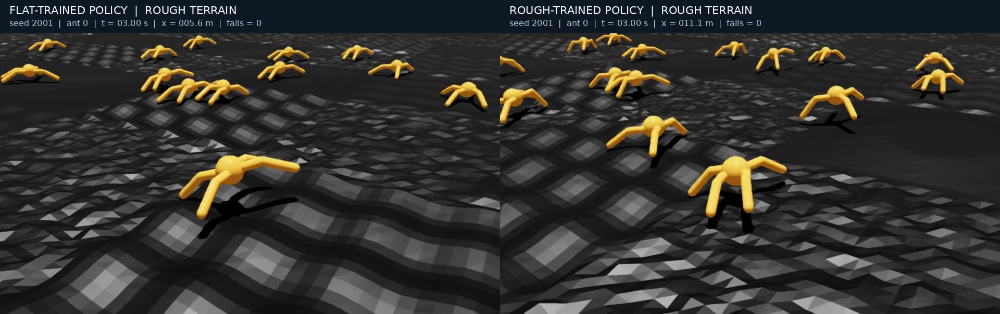

# 실제 지형과 보행 영상

모든 사진과 영상은 저장한 모델을 **Isaac Sim에서 실제 실행하면서 RGB로 촬영한 장면**이다. 지형과 물리 설정은 공개 코드 그대로이며 카메라만 보행을 따라간다.

## 생성된 험지


seed 2001로 생성한 720×720m 지형의 일부를 확대한 모습이다. 요철·파도·경사 타일이 서로 연결돼 있고, 개미의 XY 시작 위치는 원본과 같은 5m 간격 격자다.


## 같은 험지에서 두 모델 비교

[](../artifacts/media/comparison.mp4)

**왼쪽은 평지 학습 모델, 오른쪽은 험지 학습 모델**이다. 위 GIF는 앞 6초의 실시간 미리보기다. 전체 영상은 16초이며 장면을 생략하거나 속도를 높이지 않았다.

**[전체 16초 비교 영상 보기](../artifacts/media/comparison.mp4)**

| 개별 영상 | 실행한 지형 | 목적 |
| --- | --- | --- |
| [평지 학습 모델 → 원본 평지](../artifacts/media/flat_on_flat.mp4) | 원본 plane 설정 | 원래 학습한 환경의 기준 보행 |
| [평지 학습 모델 → 험지](../artifacts/media/flat_on_rough.mp4) | seed 2001 랜덤 험지 | 지형이 바뀌었을 때의 동작 |
| [험지 학습 모델 → 같은 험지](../artifacts/media/rough_on_rough.mp4) | 동일한 seed 2001 랜덤 험지 | 험지 학습 후 동작 |



## 촬영 조건과 해석

- 촬영일: 2026-09-29. 각 영상 16초, 30fps, 실제 시뮬레이션 시간과 재생 시간의 비율 1:1.
- 화면에는 16개 환경을 생성하고 **환경 0의 개미**를 따라간다. 환경·개미 인덱스를 실패/성공 장면에 맞춰 바꾸지 않았다.
- 험지 비교의 두 모델은 동일한 지형 seed 2001, 초기 상태, 카메라 위치·추적 방식을 사용한다. 초기 로봇 상태의 SHA-256이 같은지도 검사했다.
- 학습 때의 탐색 노이즈를 끄고 actor 평균 액션을 사용한다. 험지의 평지 모델에도 기존 정량 평가와 같은 지면 상대 높이 관측을 입력한다.
- 화면의 `x`는 환경 0 개미의 최초 출발점 대비 전진 변위다. 자동 리셋되면 출발점 근처로 돌아가 값도 작아진다. 누적 경로 길이가 아니다.
- `falls`는 촬영 시작 후 환경 0에서 발생한 낙상 종료 횟수다. 넘어짐과 자동 리셋 장면을 포함한다.
- **이 영상은 기존 512개 환경의 첫 에피소드 정량 평가와 별개의 16개 환경 데모**다. 환경 수가 달라 격자의 위치 범위도 달라지므로, 한 개미의 영상 결과를 기존 완주율로 해석하지 않는다.
- 원본 평지 영상은 보행의 기준 장면이며, 이 한 영상만으로 평지 성능 유지율을 측정했다고 주장하지 않는다.

각 영상의 모델 해시·초기 상태 해시·프레임 수·시간별 변위·낙상 수는 같은 이름의 JSON 파일에 있다. 미디어 파일의 SHA-256은 [`index.json`](../artifacts/media/index.json)에 기록했다.

## 촬영 재현

패치를 적용한 IsaacLab_RS와 실행 가능한 Isaac Sim 환경이 필요하다. 공개 저장소 루트에서:

```bash
export ISAACLAB_ROOT="$(cd ../IsaacLab_RS_ant && pwd)"
python -m pip install -r requirements-media.txt

# 같은 험지에서 두 모델을 순서대로 촬영
"$ISAACLAB_ROOT/isaaclab.sh" -p "$PWD/scripts/record_media.py" \
  --headless --terrain rough --models flat rough --seed 2001 --num_envs 16 --seconds 16

# 원본 평지 설정에서 평지 모델 촬영
"$ISAACLAB_ROOT/isaaclab.sh" -p "$PWD/scripts/record_media.py" \
  --headless --terrain flat --models flat --seed 2001 --num_envs 16 --seconds 16

# 동일 조건을 확인하고 좌우 비교 영상과 미리보기 제작
python scripts/compose_media.py
```

GPU 촬영에는 Isaac Lab용 Python 환경을 사용한다. 기본 저장 경로는 `artifacts/media/`이고 `--output`으로 바꿀 수 있다. MP4 재생을 지원하지 않는 GitHub 화면에서는 파일을 내려받아 재생할 수 있으며, README의 GIF는 바로 볼 수 있다.
