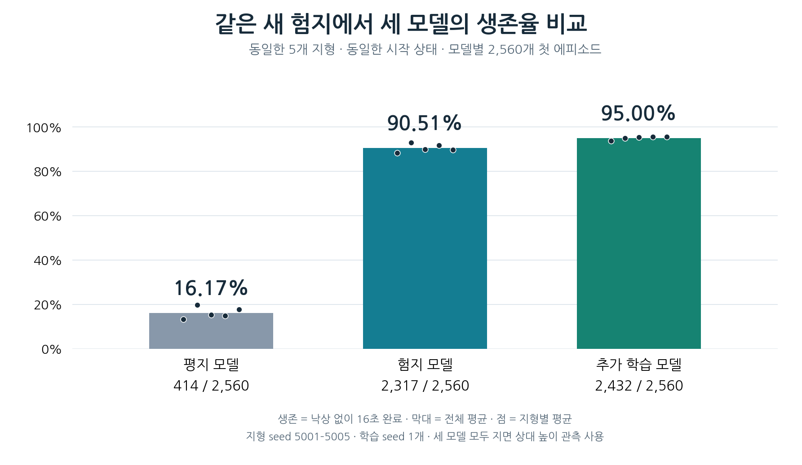

# 같은 지형에서 비교한 세 모델의 결과

2026-10-01에 평지 `flat.pt`, 험지 `rough.pt`, 추가 학습 `recovery.pt`를 동일한 다섯 새 지형에서 재평가했다. 이 결과가 본문의 기존 2001/2002 및 4001/4002 비교를 대체한다. 과거 수치는 새 평균에 포함하지 않았다.

## 공통 조건과 전체 결과

지형 seed는 5001~5005, 모델마다 시드별 512마리의 첫 16초 에피소드를 측정했다. 모델별 2,560개, 전체 7,680개 에피소드다. 시드마다 동일한 지형 인스턴스를 공유하고 모델을 바꿀 때 동일 seed로 다시 리셋했다. 모든 시드에서 세 모델의 몸통·관절 초기 상태 SHA-256이 일치했다.

평가 전에 [프로토콜](../results/models/protocol.json)에 모델·시드·평가기 해시를 고정했다. 재학습, 체크포인트 재선택, 결과를 본 뒤 시드 제외는 하지 않았다. 모든 정책은 탐색 노이즈 없는 actor 평균 액션을 사용한다.

| 모델 | 생존율 | 낙상 / 2,560회 | 평균 거리 | 평균 속도 | 몸체 각속도 RMS | 액션 변화 RMS |
| --- | ---: | ---: | ---: | ---: | ---: | ---: |
| 평지 | 16.17% | 2,146 | 15.28m | 1.83m/s | 1.589 rad/s | 0.4041 |
| 험지 | 90.51% | 243 | 67.50m | 4.35m/s | 2.062 rad/s | 0.3311 |
| 추가 학습 | 95.00% | 128 | 65.77m | 4.17m/s | 1.788 rad/s | 0.3002 |

생존은 낙상 없이 16초를 완료한 경우다. 위 평균은 생존한 개체만이 아니라 낙상한 개체까지 포함한 모든 첫 에피소드 기준이다. 그래프의 점은 다섯 지형 각각의 평균이며 신뢰구간이 아니다.

## 지형별 생존율

| 지형 seed | 평지 생존율 | 험지 생존율 | 추가 학습 생존율 | 험지 → 추가 학습 낙상 수 |
| --- | ---: | ---: | ---: | ---: |
| 5001 | 13.28% | 88.28% | 93.75% | 60 → 32 |
| 5002 | 19.73% | 92.97% | 94.92% | 36 → 26 |
| 5003 | 15.23% | 89.84% | 95.31% | 52 → 24 |
| 5004 | 14.84% | 91.80% | 95.51% | 42 → 23 |
| 5005 | 17.77% | 89.65% | 95.51% | 53 → 23 |

시드마다 세 모델에 같은 512개 시작 상태를 사용했다. 전체 평균에서 유리한 시드만 선택하지 않았다.

## 1. 평지 모델: 험지 전이의 기준

원본 평면에서 1,000회 학습한 모델이다. 이번 험지 생존율은 16.17%, 평균 전진 거리는 15.28m였다. 이 수치는 평지 보행 성능이 아니라 새 험지에 적용한 성능이다. 평지 보행 영상은 별도의 정성적 데모다.

평지 모델에도 다른 모델과 같은 지면 상대 높이 관측을 입력했다. 원본의 절대 Z 관측을 그대로 사용한 결과는 아니다.

## 2. 험지 모델: 환경 적응의 효과

평지 모델과 같은 1,000회 학습량으로 랜덤 험지에서 별도 학습했다. 동일한 평가 지형에서 생존율은 16.17% → 90.51%로 74.34%p, 평균 거리는 15.28m → 67.50m로 늘었다.

지형·높이 관측·충돌 처리·종료 판정이 함께 바뀐 시스템의 결과다. 이 실험은 각 변경의 단독 효과를 분리하지 않는다.

## 3. 추가 학습 모델: 안정성 개선과 속도의 변화

험지 모델의 가중치에서 리워드를 바꾸고 600회 더 학습했다. 같은 다섯 평가 지형에서 험지 모델 대비:

- 생존율: 90.51% → 95.00%, 4.49%p 증가.
- 낙상: 243회 → 128회, 47.3% 감소.
- 몸체 각속도 RMS: 2.062 → 1.788 rad/s, 13.3% 감소.
- 평균 전진 속도: 4.35m/s → 4.17m/s, 4.2% 감소.
- 평균 전진 거리: 67.50m → 65.77m, 2.6% 감소.

다섯 지형 중 5개에서 추가 학습 모델의 생존율이 높았다. 동일한 개체 시작 상태끼리 비교하면 추가 학습 모델만 생존한 경우 207개, 험지 모델만 생존한 경우 92개로 순 생존 증가는 115개다.

이 비교에는 보상 변경과 600회의 추가 학습량이 모두 포함된다. 보상만의 효과를 확인한 동일 예산 대조 실험은 [과거 검증 기록](archive/reward_comparison.md)에 별도로 보존했다. 그 실험의 수치는 이번 평균에 섞지 않는다.

## 원자료와 검증

- 시드별 모든 개체의 결과: [5001](../results/models/seed_5001.json), [5002](../results/models/seed_5002.json), [5003](../results/models/seed_5003.json), [5004](../results/models/seed_5004.json), [5005](../results/models/seed_5005.json).
- [집계 JSON](../results/models/summary/aggregate.json), [시드별 CSV](../results/models/summary/per_seed.csv), [평가 프로토콜](../results/models/protocol.json).
- [평가 스크립트](../scripts/evaluate_models.sh), [개체별 자료 검사·집계](../scripts/analyze_models.py), [그래프 코드](../scripts/plot_survival.py).

초기 상태·모델·평가기 코드 해시와 개체별 생존·낙상·시간·거리·속도·몸체 각속도·액션 변화 배열을 저장했다. 모델 파일과 원자료 파일의 해시는 [manifest](../manifest.json)에서 확인할 수 있다. 공개 파일 검증 명령과 실행 방법은 [재현 문서](REPRODUCE.md)에 있다.

## 해석 범위

학습 seed는 하나이며 평가 지형도 같은 생성 분포에서 뽑았다. 다섯 지형 재평가가 실세계, 새로운 물성, 센서 노이즈나 다른 지형 분포까지 보장하지 않는다. 개체들은 같은 지도 일부를 공유하므로 전체 에피소드를 서로 독립적인 지형 표본으로 해석하지 않는다.

낮은 몸체 RMS만으로 안정성을 판단하지 않는다. 평지 모델은 빨리 넘어져 긴 보행을 경험하지 못할 수 있고, 추가 학습 모델은 속도가 낮아진 영향도 있을 수 있다. 같은 속도에서의 비교나 개별 보상 항의 단독 효과는 검증하지 않았다. 전진 거리는 자동 리셋 때문에 종료 직전 한 제어 스텝이 빠질 수 있다.

[평가 조건·지표 정의](EXPERIMENTS.md) · [세 모델 보행 영상](MEDIA.md) · [이전 실험 기록](archive/README.md)
