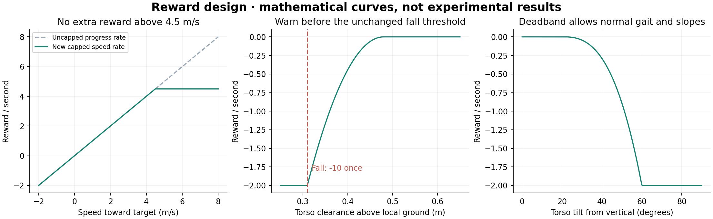

# 넘어짐을 직접 다루는 보상 재설계

기존 안정성 추가 학습은 토크 변화와 roll/pitch 각속도만 감점했다. 하지만 험지에서 다리를 바꾸어 딛고 균형을 회복하는 동작도 이 수치를 키울 수 있다. 두 패널티를 단순히 크게 하는 실험은 오히려 완주율을 낮췄다. 원래 보상에는 넘어지는 순간의 직접 감점이 없고, 자세 항목도 수직 정렬 기준을 넘으면 고정 보너스를 주는 방식이다.

새 `Isaac-Ant-Recovery-v0`는 보상만 바꾼 별도 태스크다. 기존 `Isaac-Ant-v0`와 `Isaac-Ant-Stable-v0`의 결과를 재현할 수 있도록 보존했다. 이름의 Recovery는 낙상 방지를 위한 위험 보상을 뜻하며, 쓰러진 뒤 스스로 일어나는 기술을 학습했다는 의미는 아니다. 넘어짐은 여전히 에피소드 종료다.



그림은 설계한 함수의 곡선이며 학습 결과 그래프가 아니다.

## 바꾼 항목

| 항목 | 기존 안정성 보상 | 새 보상 | 의도 |
| --- | --- | --- | --- |
| 전진 | 목표까지 거리 감소율 | 목표 방향 평면 속도, ±4.5m/s로 제한 | 속도를 계속 높여 얻는 보상 제한 |
| 넘어짐 | 직접 사건 감점 없음 | 넘어지는 순간 -10 | 실패를 직접 비용으로 연결 |
| 지면 상대 몸높이 | 0.31m 미만일 때 종료 | 0.48m 아래부터 연속 위험 감점 추가 | 넘어지기 전에 학습 신호 제공 |
| 큰 기울기 | upright 기준 통과 시 +0.1 | 기존 보너스 + 연속 위험 감점 | 임계값 통과 여부만으로 표현하지 못하는 위험 반영 |
| 액션 변화 / 몸체 각속도 | -0.01 / -0.025 | 유지 | 강한 감점으로 회복 움직임까지 과하게 제한하지 않음 |

유지한 항목: alive +0.5, upright +0.1, heading +0.5, action L2 -0.005, power proxy -0.05, joint limit -0.1. 지형·센서·60차원 관측·8개 토크 액션·16초 제한·0.31m 낙상 기준·시작 배치는 바꾸지 않았다.

## 실제 식과 단위

`dt = 1/60 s`, `clip(x) = min(max(x, 0), 1)`이라고 하자. 모든 연속 항목은 Isaac Lab RewardManager에서 `weight × term × dt`로 더해진다.

- 전진 항목: `clamp(dot(v_xy, direction_to_target), -4.5, 4.5) × dt`.
- 몸높이 항목: `-2 × clip((0.48 - h) / (0.48 - 0.31))² × dt`.
- 기울기 항목: `-2 × clip((0.93 - up) / (0.93 - 0.5))² × dt`.
- 넘어짐 항목: `-10 × terminated`. 함수에서는 `terminated / dt`를 반환해 관리자의 `× dt`와 상쇄한다.

`h`는 몸통 바로 아래 단일 ray의 지면 높이에 대한 상대 높이다. 지면 ray가 없는 경우 기존 종료 처리와 일관되게 최대 위험으로 취급한다. `up = -projected_gravity_b.z`는 몸체가 수직일 때 1이다. 약 21.6° 이내 기울기는 이 추가 항목의 감점이 없고 60°에서 포화한다. 이 값들은 안전을 보장하는 물리 임계값이 아니라 이번 실험의 보상 파라미터다.

보상 함수를 바꿨으므로 학습 중 total reward의 숫자를 기존 모델과 직접 비교하지 않는다. 공통 환경에서 측정한 생존·속도·거리·몸체 움직임으로 평가한다.

속도 4.5m/s는 물리 속도 제한이 아니다. 그보다 빠르게 움직일 수 있지만 추가 전진 보상이 없다. 에너지와 생존 등의 항목도 함께 최적화하므로 최종 평균 속도가 낮아질 수 있다. 평가는 생존율과 이동거리·속도를 함께 보고 이 상충 관계를 드러낸다.

정상 시간 종료에는 넘어짐 감점을 주지 않는다. 마지막 스텝에 실제로 넘어지고 시간 제한에도 도달한 경우에는 낙상으로 취급한다. 기존 종료 관리자에서 termination을 구한 다음 보상을 계산하고, 이후 자동 리셋한다.

전진을 기존 큰 음수 거리 potential의 차분에서 직접 속도 투영으로 바꿨다. 이는 같은 목표 방향을 보상하면서 float32의 큰 수 차분을 피한다. 하지만 원래 식과 스텝별로 완전히 동일한 것은 아니다. 이번 비교는 보상 구성 전체의 효과이며, 개별 항목의 단독 인과효과를 분리한 ablation은 아니다.

## 학습과 평가

[`2026-09-29_reward_plan.md`](2026-09-29_reward_plan.md)에 학습 전에 고정한 조건과 평가 seed를 기록했다. 기존 보상으로 같은 600회만큼 추가 학습한 control을 두어, 더 오래 학습한 효과를 구분할 수 있도록 했다. optimizer 설정과 초기 actor/critic/std도 동일하다. 실제 저장된 YAML을 비교해 보상·로그 경로·실험 이름을 제외한 설정이 모두 같음을 확인했고, [`training_comparison.json`](../results/rewards/training_comparison.json)에 기록했다.

```bash
# 공개 저장소 루트, Isaac Lab용 환경을 활성화한 뒤 실행
export ISAACLAB_ROOT=/path/to/patched/IsaacLab_RS
bash scripts/train_rewards.sh

# 공개된 최종 모델로 동일 첫 에피소드 평가
bash scripts/evaluate_rewards.sh 4001 4002
python scripts/analyze_rewards.py --results-dir results/reproduced_rewards \
  --output-dir results/reproduced_rewards_summary

# 시뮬레이터 없이 보상 함수 경계 조건 확인 (torch 필요)
python scripts/test_reward_terms.py
```

학습을 다시 실행한 모델은 `logs/rsl_rl/ant_reward_control/`와 `logs/rsl_rl/ant_recovery/`에 저장된다. `evaluate_rewards.sh`의 기본 입력은 공개 체크포인트이므로 재학습 결과를 평가하려면 `evaluate_ant.py --checkpoints ...`에 해당 실행의 `model_599.pt`를 지정해야 한다.
