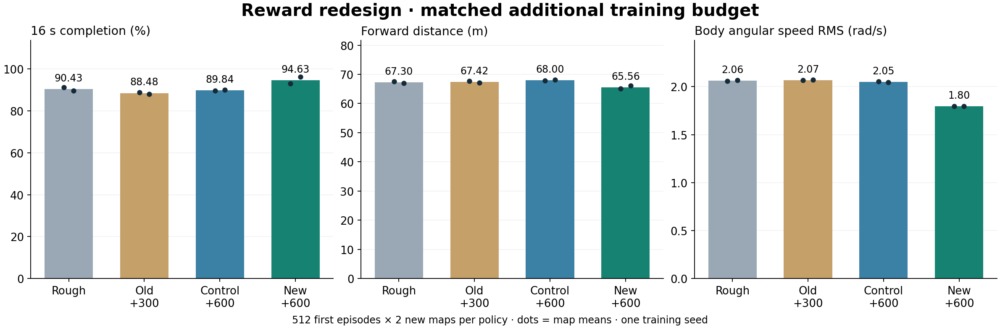
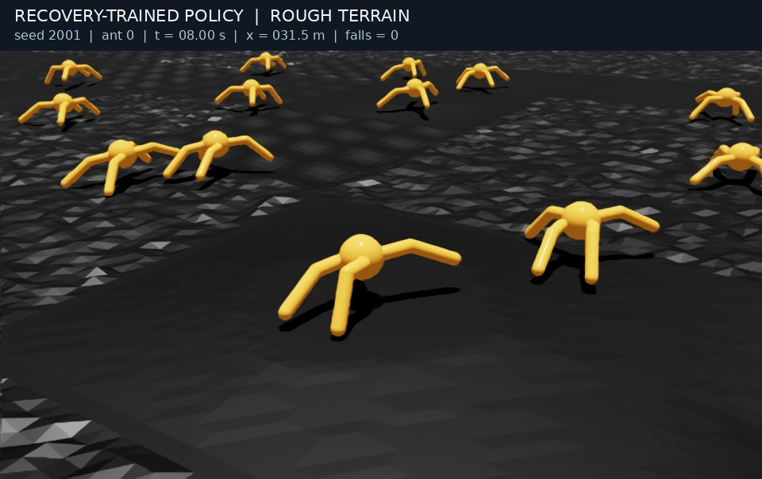

# 보상 재설계 결과 (2026-09-29)

같은 초기 험지 모델에서 각각 600회 추가 학습했다. 원래 보상을 유지한 control 대비 새 recovery의 16초 생존율은 89.84% → 94.63%였고, 낙상은 104회 → 55회로 47.12% 줄었다.

속도와 거리에는 비용이 있었다. 평균 전진속도는 5.47%, 이동거리는 3.58% 감소했다. 이번 개선은 최고 속도나 최대 이동거리보다 덜 넘어지고 몸체 회전을 줄이는 쪽의 개선이다.

## 최종 두 지형: 모델당 1,024개 첫 에피소드

| Model | Completion | Falls / 1024 | Distance | Speed | Action RMS | Body RMS |
| --- | ---: | ---: | ---: | ---: | ---: | ---: |
| Rough baseline | 90.43% | 98 | 67.30 m | 4.34 m/s | 0.3318 | 2.0630 rad/s |
| Old stability +300 | 88.48% | 118 | 67.42 m | 4.37 m/s | 0.3284 | 2.0678 rad/s |
| Original reward +600 | 89.84% | 104 | 68.00 m | 4.40 m/s | 0.3285 | 2.0496 rad/s |
| New reward +600 | 94.63% | 55 | 65.56 m | 4.16 m/s | 0.2996 | 1.7958 rad/s |

지형 seed 4001/4002, 각 512마리, 최대 16초, deterministic actor. 기존 rough와 stable도 같은 지형에서 다시 평가했다. 개발 지형 seed 3001은 이 평균에 포함하지 않았다. 이전 2001/2002 평가와도 합치지 않았다.

| 지형 seed | 모델 | 생존율 | 낙상 / 512 | 거리 (m) | 속도 (m/s) | 몸체 각속도 RMS (rad/s) |
| --- | --- | ---: | ---: | ---: | ---: | ---: |
| 4001 | rough | 91.21% | 45 | 67.62 | 4.351 | 2.0602 |
| 4001 | stable | 88.87% | 57 | 67.75 | 4.391 | 2.0659 |
| 4001 | control | 89.65% | 53 | 67.86 | 4.410 | 2.0546 |
| 4001 | recovery | 92.97% | 36 | 65.05 | 4.156 | 1.7942 |
| 4002 | rough | 89.65% | 53 | 66.99 | 4.327 | 2.0659 |
| 4002 | stable | 88.09% | 61 | 67.10 | 4.345 | 2.0697 |
| 4002 | control | 90.04% | 51 | 68.14 | 4.388 | 2.0445 |
| 4002 | recovery | 96.29% | 19 | 66.08 | 4.161 | 1.7973 |

## 기존 추가 학습과 무엇이 달라졌나

기존 stable은 이 두 지도에서 88.48% 생존했다. 새 recovery는 94.63%였다. 다만 stable은 추가 300회, recovery는 600회이므로 이 차이를 보상만의 효과로 해석하지 않는다. 보상 효과의 주 비교는 같은 600회인 control ↔ recovery다.

주 비교에서 생존율은 +4.79%p, 몸체 각속도 RMS는 -12.38%, action 변화 RMS는 -8.82%였다. 두 최종 지도에서 모두 생존율이 높았다. 평균 속도는 4.399 → 4.158m/s, 평균 거리는 68.00 → 65.56m였다.

원래 보상으로만 600회 더 학습한 control이 rough보다 모든 지표에서 좋아지지는 않았다. 추가 반복 횟수 자체를 안정성 개선으로 간주하지 않은 이유다.

## 같은 출발 상태끼리 비교

같은 개체 번호·초기 상태를 대응시켰을 때 recovery만 생존한 경우는 86개, control만 생존한 경우는 37개였다. 순차이는 49개다. 따라서 모든 출발 상태에서 개선된 것은 아니다.

지도별로 대응 개체를 재표본한 5,000회 bootstrap의 생존율 차이 95% 구간은 +2.64~+6.93%p였다. 이는 이 두 지도와 학습된 정책을 고정한 조건부 구간이다. 학습 seed 간 변동, 새로운 지형 분포, 인접한 시작 위치 사이 상관은 포함하지 않으므로 일반적인 강건성 보장의 구간이 아니다.

각 평가 JSON에는 개체별 생존/실패, 생존 시간, 전진 거리·속도, 몸체 각속도 RMS, action 변화 RMS 배열이 있다. 모델과 평가기 코드 SHA-256, 정책별로 일치하는 초기 상태 SHA-256도 저장했다.

## 실험 조건과 보상

- rough.pt에서 actor/critic/std를 읽고 새 optimizer로 시작했다.
- 두 실행 모두 seed 42, 4,096 환경, rollout 32, 600회 = 78,643,200 transition.
- learning rate 1e-4 고정, entropy 0.001 및 나머지 PPO 설정 동일.
- 저장된 설정을 대조해 보상·출력 경로·실험 이름 외에는 동일함을 확인했다.
- 새 보상: 전진 속도 보상 상한 4.5m/s, 낙상 사건 -10, 낮은 몸높이와 큰 기울기의 연속 위험 감점.
- 기존 토크 변화·몸체 각속도 패널티는 유지. 관측·액션·지형·종료 기준은 변경하지 않았다.
- 처음 정한 마지막 checkpoint model_599.pt 사용. 개발 평가 후에도 가중치나 checkpoint를 바꾸지 않았다.

학습 중 보상 총점은 서로 다른 함수로 계산되므로 직접 비교하지 않았다. 마지막 100회 학습 중 낙상 비율 평균은 control 9.49%, recovery 6.03%였지만, 주 결론은 위의 별도 첫 에피소드 평가를 사용한다.

## 해석과 남은 한계

안정성을 우선하면 새 `recovery.pt`를 사용할 만한 결과다. 최대 전진 거리나 속도를 우선하면 기존 모델과의 상충 관계를 고려해야 한다. `rough.pt`, `stable.pt`, control을 모두 보존해 직접 비교할 수 있다.

이름의 Recovery는 낙상 방지 보상이며 쓰러진 뒤 다시 일어나는 정책은 아니다. 또 속도를 낮춘 효과가 몸체 각속도 감소에 기여할 수 있다. 동일 속도로 맞춘 비교나 속도 상한·낙상 감점·위험 보상의 개별 ablation은 아직 하지 않았다. 학습 seed가 하나이고, 평가는 같은 지형 생성 분포의 새로운 seed 두 개다.

## 실제 보행과 재현 자료

[새 모델 16초 보행 영상](../../artifacts/media/reward_revision/recovery_on_rough.mp4)은 seed 2001, 16환경의 개미 0을 촬영한 정성적 데모다. 위의 512환경 정량 평가와 별개이며 성능 수치의 근거로 쓰지 않았다.

- [보상 설계·수식·실행 명령](../REWARD_DESIGN.md)
- [실행 전에 기록한 조건 및 개발 평가 후 기록](../2026-09-29_reward_plan.md)
- [최종 원자료](../../results/rewards/test), [개발 원자료](../../results/rewards/development)
- [집계·대응 비교 JSON](../../results/rewards/summary/aggregate.json)
- [실제 학습 설정 비교](../../results/rewards/training_comparison.json)
- [분석 스크립트](../../scripts/analyze_rewards.py), [학습 재현](../../scripts/train_rewards.sh)
